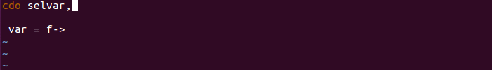

in progress...

ncl_lazy_vim README
===================

If you are using vi/vim/gvim for scripting with NCL, you can sometimes hardly remember NCL commands or you are just too lazy to type out "gsFillWTF..." all the time, this might be something for you.


Configuration instructions
--------------------------
1. Download the two .txt files "NCL_functions.txt" and "NCL_resources.txt" from the ".vim" folder in this repository into your ".vim" folder
2. Add the lines of "add_ncl_complete_to_your_vimrc" to your "~/.vimrc" to include the complete function <br>
```
cat add_ncl_complete_to_your_vimrc >> ~/.vimrc
```
If you don't have a .vimrc file yet, you may also just my working example "example.vimrc" and rename it in your $HOME <br>

Optional: <br>
1. Variable completion: Set a file path and 'ENABLE' vars_completion in your ".vimrc" <br> - requires CDO - if you have a neat idea how to implement it with NCL commands please approach me
 <br>
2. For now, the first 12 (random number) words of NCL Resources are displayed in the pop-up window before the last two words as "Default information" separated by "...". If you usually work on a wide vi window, you can modify this number of strings.
3. If you want to use &lt;Tab> for auto-completion like in your shell, add those lines to your .vimrc <br> FIXME: Doesnt replace &lt;C-U>&lt;C-U> yet, but only &lt;C-N> - should replace &lt;C-X><lt;C-U> for initial hit, &lt;C-U> or &lt;C-N> for others and <lt;Tab> if no string before 
```
" Use TAB to complete when typing words, else inserts TABs as usual.
" Uses dictionary and source files to find matching words to complete.
" "See help completion for source,
" Note: usual completion is on <C-n> but more trouble to press all the time.
" Never type the same word twice and maybe learn a new spellings!
" Use the Linux dictionary when spelling is in doubt.
" Window users can copy the file to their machine.
function! Tab_Or_Complete()
  if col('.')>1 && strpart( getline('.'), col('.')-2, 3 ) =~ '^\w'
    return "\<C-N>"
  else
      return "\<Tab>"
  endif
endfunction
:inoremap <Tab> <C-R>=Tab_Or_Complete()<CR>
```
Source: http://vim.wikia.com/wiki/Smart_mapping_for_tab_completion <br>
The usual &lt;Tab> command will still be executed when no completion is feasable, eg. in the beginning of (empty) lines <br>
4. If you fancy other auto-completion setting, play with the line
```
set complete=longest,menuone
```
The current setting completes up to the last common string and then shows a menu. Other options are listed in the vim help or http://vimdoc.sourceforge.net/htmldoc/options.html#'completeopt' <br>

<br>

For syntax highlighting: <br>
1. coming soon dynamical hopefully <br> for now data from https://www.ncl.ucar.edu/Applications/editor.shtml


Operating instructions
----------------------
Start typing your desired cdo command and hit &lt;Control-X>&lt;Control-U>
```
res@gsF<Ctrl-X><Ctrl-U>
addf<Ctrl-X><Ctrl-U>
```
Get the following autocompletion options 
```
gsFillBackgroundColor   NCL Res: This resource of type ... Default: Transparent
gsFillColor             NCL Res: This resource of type ... Default: Foreground
or
addfile                 NCL Func.: 
addfiles                NCL Func.:
or
<ncl_command>           <type>: <description>         ... Default: <value>
...
```
Hit &lt;Ctrl-N> go get the first shown match
```
res@gsFillBackgroundColor
or
addfile
```
Hit another &lt;Ctrl-N> to choose the next match or move down with arrow keys and hit <Enter> for your choice 


Copyright and licensing information
-----------------------------------
* helpme

Known bugs
----------
* just starting
* static ncl data

Contact information
-------------------
Aaron Spring <br> Bundesstraße 53 <br> ZMAW Room 229 <br> aaron.spring@mpimet.mpg.de <br> <br> 
Looking forward to receiving your questions, comments or wishes


Changelog
---------
* v0.1: 
uses all NCL resources and NCL functions from website as of 2016/09/18 <br>
also completes variables gathered by 'cdo vardes files' if cdo installed and vars_completion enabled <br>
requires '*.ncl' files <br>
ncl_completion can be enabled or disabled in .vimrc <br> 

Working on
----------
* syntax highlighting
* getting functions and resources dynamically, see example uses 'cdo --operators' https://github.com/aaronspring/cdo_lazy_vim
* anything else needed?

Credits and acknowledgements
----------------------------
* Prince K Xavier, the dude who set up auto-completion for NCL and made me think to do this for CDO first and now I'm back to NCL
 

Sister project
--------------
* same stuff for CDO: https://github.com/aaronspring/cdo_lazy_vim
